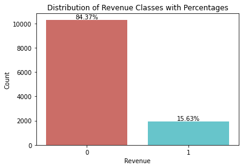
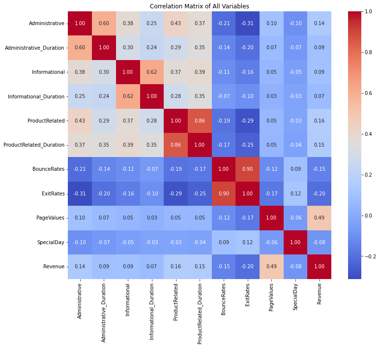
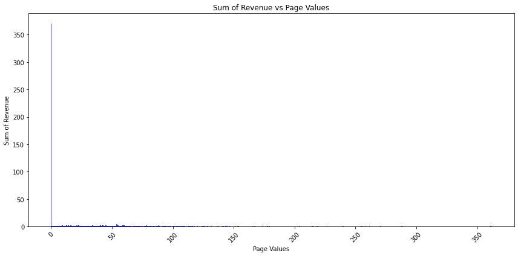
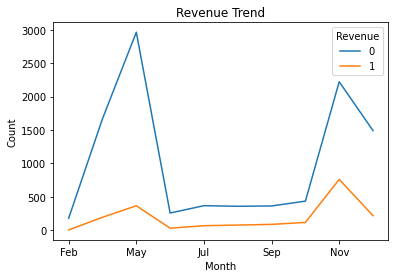
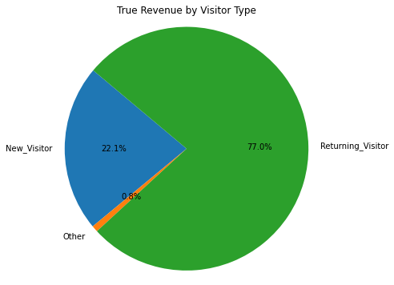
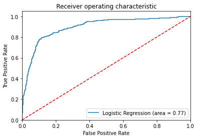
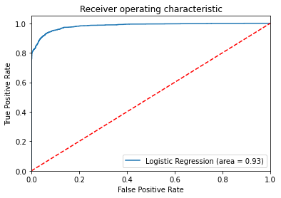
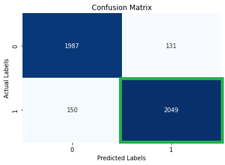
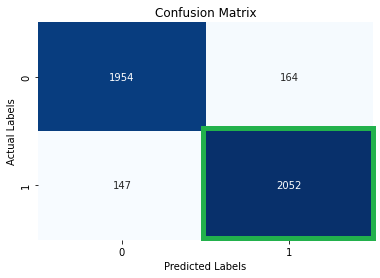

# Online Shopper's Purchasing Intent: A Classification Problem #
## 1. Introduction ##
The rise of e-commerce has created significant opportunities, but conversion rates remain a challenge. Unlike physical stores, where salespeople provide personalized recommendations, e-commerce relies on technology to mimic this. Machine learning models are increasingly used to predict whether a customer session will result in revenue and to identify key factors influencing purchase decisions. This projects aim to build one such machine learning model to improve conversion rates and reduce cart abandonment.

## 2. About the Dataset ##
The dataset is sourced from the UC Irvine Machine Learning Repository. Following are the details about the dataset:
* Contains 12,330 user sessions over a 1 year period. Each session belongs to a unique user.
* Contains 17 features (10 numerical and 7 categorical).
* The target variable ‘Revenue’ is defined as whether the customer made a transaction or not.
* Examples of numerical features: bounce rate, page value, product-related duration (in sec), etc.
* Examples of categorical features: browser, weekend, month, etc.
* Doesn't contain any missing values.

## 3. Exploratory Data Analysis (EDA) ##
***3.1. Class Imbalance***\
The target variable is imbalanced. We will use SMOTE (Synthetic Minority Oversampling Technique) to create synthetic samples for the minority class.

  <figure>
    
    <figcaption>Class Imbalance of Target Variable Revenue</figcaption>
  </figure>

After using SMOTE, there are 14,690 instances with 50% belonging to the positive class and 50% to the negative class.

***3.2. Correlation Matrix***\
We observe a high correlation between revenue and page values from the correlation matrix.

  <figure>
    
    <figcaption>Comparing the correlation between revenue and other features</figcaption>
  </figure>

***3.3. Page Values***\
The distribution of page values is highly right-skewed, with most of the customer sessions having a value of 0. 

  <figure>
    
    <figcaption>Right-Skewed Distribution of Page Values</figcaption>
  </figure>

We will convert page values to a binary variable containing two values - 0 and 1 (non-zero page values)

***3.4. Monthly Trend of Revenue***\
There are spikes in May and November aligning with Memorial Day and Black Friday/Cyber Monday traffic. Despite high holiday sessions, conversion rates remain low, highlighting a need to improve sales strategies.

  <figure>
    
    <figcaption>Monthly Revenue Trend</figcaption>
  </figure>

***3.5. Revenue Share by Visitor Type***\
We observe from the pie chart that returning visitors make the most purchases.

  <figure>
    
    <figcaption>Revenue Share By Visitor Type</figcaption>
  </figure>

## 4. Preprocessing ##
***4.1. Oversampling and Partitioning***
* Split the dataset into training (70%) and test (30%) for testing model performance.
* In the training set, only 15% of instances belong to the positive class. We will use SMOTE (Synthetic Minority Oversampling Technique) to create synthetic samples for the minority class.
* After using SMOTE, 50% of 14,690 instances belong to the positive class.

***4.2. Recursive Feature Elimination (RFE)***
* We will use a recursive pruning process to remove the least significant and get the smallest set of significant features
* The RFE process reduces 78 features (including dummy variables) to 35 features (including dummy variables)
* The final list includes the following features: 'BounceRates', 'ExitRates', 'OperatingSystems_1', 'OperatingSystems_2', 'OperatingSystems_3', 'OperatingSystems_4', 'OperatingSystems_8', 'Browser_6', 'Browser_7', 'Region_1', 'Region_2', 'Region_3', 'Region_4', 'Region_5', 'Region_6', 'Region_7', 'Region_8', 'Region_9', 'TrafficType_1', 'TrafficType_3', 'TrafficType_4', 'TrafficType_6', 'TrafficType_10', 'TrafficType_13', 'VisitorType_Other', 'VisitorType_Returning_Visitor', 'Weekend_False', 'Weekend_True', 'Month_Aug', 'Month_Dec', 'Month_Feb', 'Month_Jul', 'Month_June', 'Month_Mar', 'Month_May', 'Month_Oct', 'Month_Sep', and 'PageValue_Binary_0'

## 5. Model Comparison and Inference ##
***5.1. Logistic Regression (With and Without SMOTE)***\
Since the revenue classes are imbalanced, we see a clear improvement in the model performance after oversampling.

  <figure>
    
    <figcaption>ROC Curve Before Oversampling</figcaption>
  </figure>

  <figure>
    
    <figcaption>ROC Curve After Oversampling</figcaption>
  </figure>

***5.2 Logistic Regression Vs Others (Confusion Matrix)***\
We are most concerned with customer sessions that generate revenue. Therefore, while comparing models, we will focus on how accurately the model classifies the positive class.

  <figure>
    
    <figcaption>Model 1: Logistic Regression</figcaption>
  </figure>

  <figure>
    
    <figcaption>Model 2: SVM</figcaption>
  </figure>

  <figure>
    
    <figcaption>Model 3: Random Forests</figcaption>
  </figure>

Looking at the True Positives, we can say that the Random Forests model has the best performance.

***5.3. Logistic Regression Vs Others (Recall and Accuracy)***
1. Logistic Regression: Recall is 0.93 and accuracy is 0.93
2. SVM: Recall is 0.93 and accuracy is 0.93
3. Random Forests: Recall is 0.93 and accuracy is 0.93 
All the models perform equally well on recall and accuracy.

## 6. Summary ##
* There are spikes in May and November aligning with Memorial Day and Black Friday/Cyber Monday traffic. Despite high holiday sessions, conversion rates remain low, highlighting a need to improve sales strategies.
* Returning visitors make the most purchases. The company should focus on onboarding new visitors using retention strategies like free membership programs to increase returning visitors frequency.
* Since the revenue classes are imbalanced, we see a clear improvement in the model performance after using SMOTE.
* All the models perform equally well when comparing recall and accuracy. They have a recall of 0.93 and an accuracy of 0.93. (NOTE: The naïve approach gives us 0.85 accuracy)
* On comparing the True Positives, Random Forests model comes out as the best model

[LinkedIn Profile Link](https://www.linkedin.com/in/praveen-satya-r-v/) | [LinkedIn Article Link](https://www.linkedin.com/pulse/online-shoppers-purchasing-intent-classification-problem-r-v--xyqfc/?trackingId=VsYqrMyaSBWpHXyV5OrSDA%3D%3D) | [UC Irvine Dataset Link](https://archive.ics.uci.edu/dataset/468/online+shoppers+purchasing+intention+dataset)